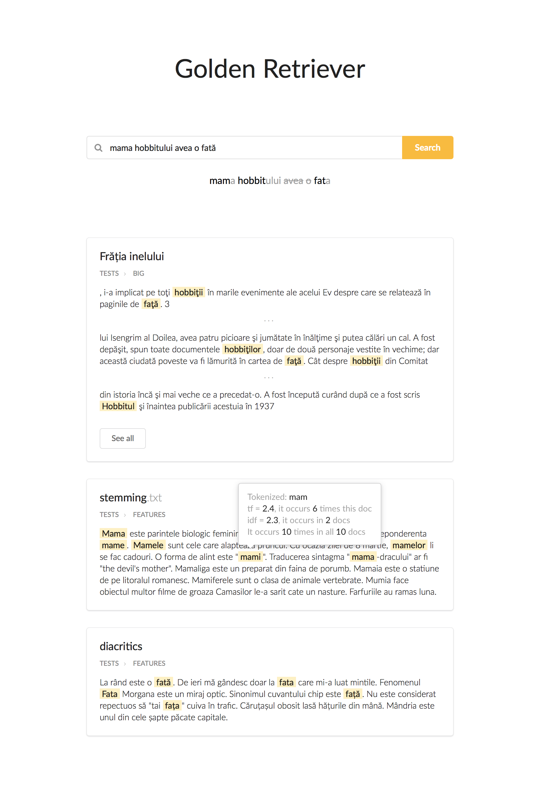

# golden-retriever

Information retrieval system for documents in romanian.

## Features
  - word stemming
  - ignores stop-word
  - case-independent
  - parsed query
  - highlight terms in fragments
  - explain scoring for each term
  - abstract score boosting

## Build
- install pylucene
- `pip install textract pdfminer flask`
- `npm install jquery semantic` and move them to `interface/lib/semantic.css` and `interface/lib/jquery.js`

## Run
1. `./indexer.py`
2. `./server.py`

## Dev
- `pug`, `coffee`, `sass` for the interface
  PyLucene samples: http://svn.apache.org/viewvc/lucene/pylucene/trunk/samples/

## Bugs
If there is only one symbol with diacritics in the file, it will not be rendered correctly. Adding at least one more (not necessarily the same) will cause all symbols with diacritics to be rendered correctly.
